# Life Tracker

A private, offline habit and daily-routine tracker for Android. No account, no internet, no ads. Everything stays on your phone.

**Version 1.2.0** - package `com.lifetracker.app` - Android 8.0 or newer.

## What it does
- Daily checklist with streaks, a year heatmap, insights and a daily reflection note.
- Make your own habits: name, time or cue, note.
- **Daily pings (new in 1.2):** set a time on any habit, or add timed pings in the Plan tab. You get a notification at that time every day, even when the app is closed. Pings come back after a reboot, a time change or an app update.
- **Tick times (new in 1.2):** when you tick a habit, the app records and shows the time ("Ticked 9:41 PM").
- Your own name, plan and timetable. Light and dark theme.
- JSON backup and restore.
- The app has no internet permission.

## Install (phone)
1. Open the **Releases** page of this repository and download `Life-Tracker-Friends.apk` from the latest release (v1.2.0).
2. Open the file. Android will ask you to allow installs from that app (browser or Files). Allow it.
3. Open Life Tracker, enter your name and start adding habits.
4. Allow notifications when asked. If you dismissed it, a banner on the Habits and Plan tabs has a **Turn on** button. For on-time pings, also allow **exact alarms** when the banner offers it (Android 12 and newer).

Check the file before you install: its SHA-256 is listed on the release page.

### Updating from 1.1.x (read this first)
Version 1.2.0 is signed with a **new key**, so Android will not install it over 1.1.x. You must uninstall the old version first, and **uninstalling deletes your data**. Keep it like this:
1. In the OLD app open **Backup** and tap **Download JSON backup**. Save the file and check it is on your phone.
2. Uninstall the old Life Tracker.
3. Install 1.2.0.
4. Open **Backup**, tap **Restore a backup** and pick your file. Habits and check-ins return. Old ticks show "Tick time not recorded" because no time was saved back then.

From 1.2.0 onward, updates install over each other normally.

## Notifications not showing?
- Settings > Apps > Life Tracker > Notifications: switch on.
- Some phone brands stop background apps. Set Life Tracker battery use to "Unrestricted" or "Not optimised".
- Without exact-alarm access, pings still arrive but can be a few minutes late.
- Test it: set a ping 2 minutes ahead.

## Build it yourself
You need Java 11 or newer, Android build-tools (30.0.3 or newer) and the platform 34 `android.jar`.
```
keytool -genkeypair -keystore my.jks -alias mine -keyalg RSA -keysize 2048 -validity 10000
export ANDROID_JAR=/path/to/android-34/android.jar
export BUILD_TOOLS=/path/to/build-tools
export SIGNING_KEYSTORE=my.jks SIGNING_ALIAS=mine SIGNING_STORE_PASSWORD=yourpassword
./build.sh
```
This produces `Life-Tracker-Friends.apk`. Keep your keystore safe and out of git: you need the same one for every future update. An APK built with your own key will not update the released one.

## Project layout
```
app/src/main/assets/index.html      the whole app screen (HTML, CSS, JS)
app/src/main/java/.../MainActivity  WebView host, backup save/restore, ping bridge
app/src/main/java/.../Pings.java    stores ping rules, schedules exact or inexact alarms
app/src/main/java/.../PingReceiver  shows the notification and schedules the next day
app/src/main/java/.../BootReceiver  restores alarms after reboot, update or time change
app/src/main/AndroidManifest.xml    permissions and receivers
app-icon.png.base64                 launcher icon (decoded to res/drawable/icon.png by build.sh)
build.sh                            command-line build and sign
```

## How to use
All screens below use demo data for a B.Tech AI student (name "Aarav"). Your own app starts empty.

**1. First launch. The app opens on a clean Today screen. Everything stays on your phone.**

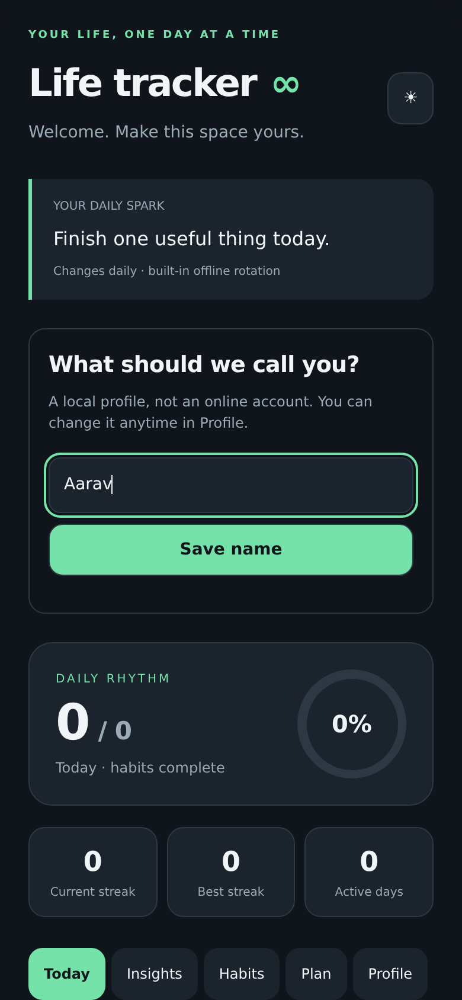

**2. Today is empty until you add habits. Open the Habits tab.**

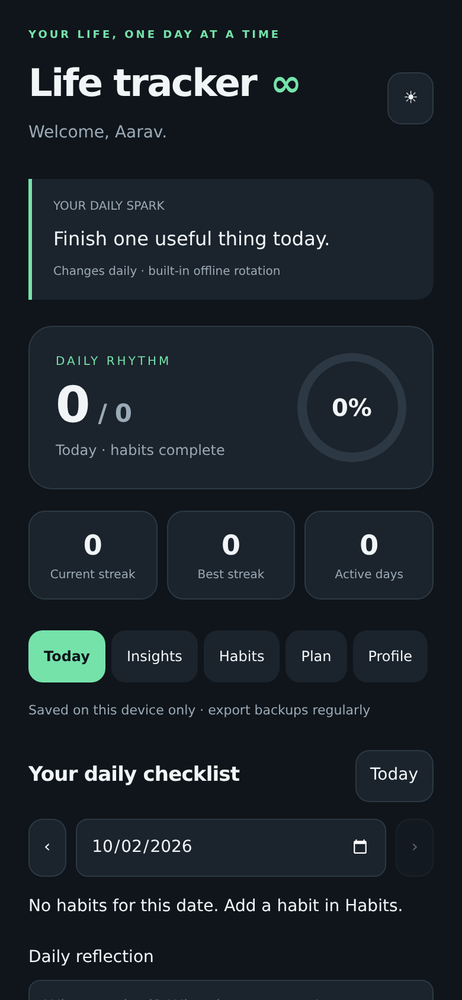

**3. Habits tab: type a habit name, a time cue, an optional daily ping time and a note, then tap Add habit. Example: Fajr with a 05:00 ping.**

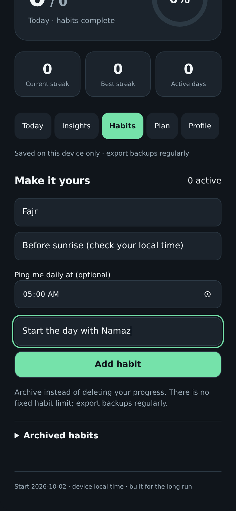

**4. Your habit list. Each one shows its ping time. This demo has the five daily prayers plus classes, ML / DL study, assignments and gym or walk.**

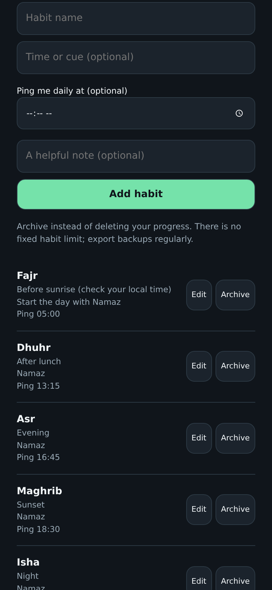

**5. Tap a habit to change its name, cue or ping time later.**

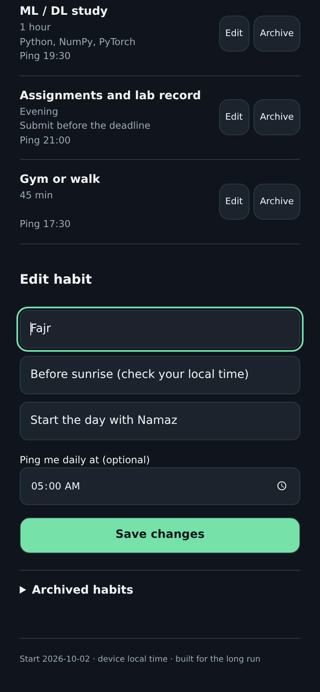

**6. Plan tab: write your weekly plan or timetable in free text.**

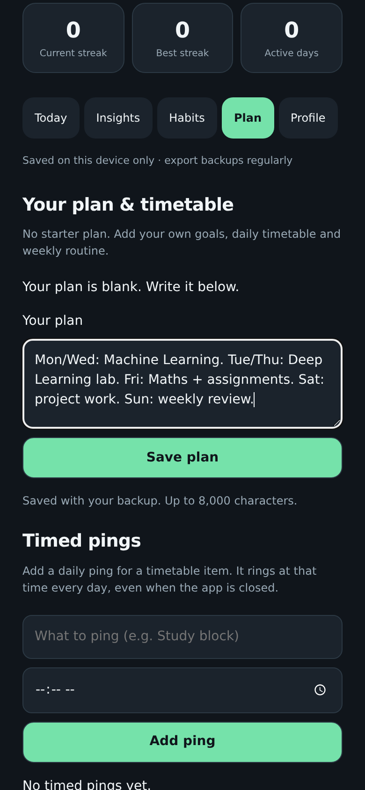

**7. Tap Save plan. The plan is saved with your backup.**

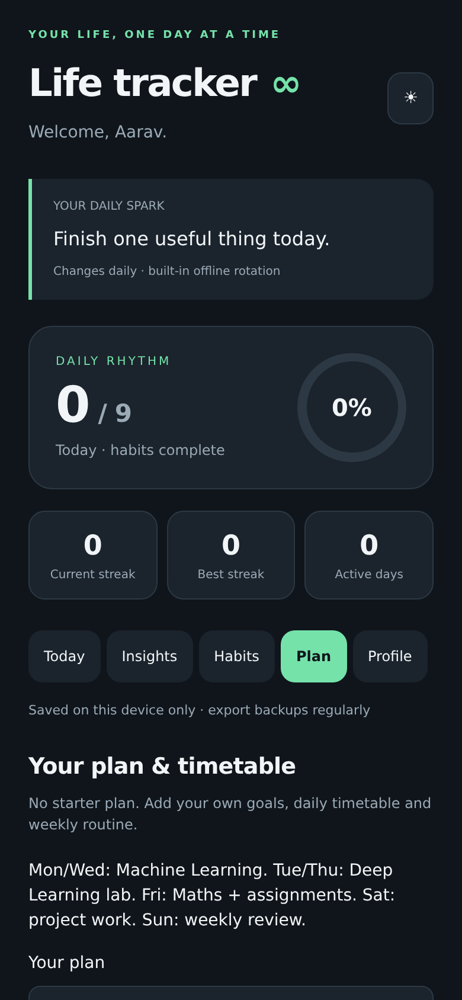

**8. Timed pings: add a ping for any timetable item, with a name and a time.**

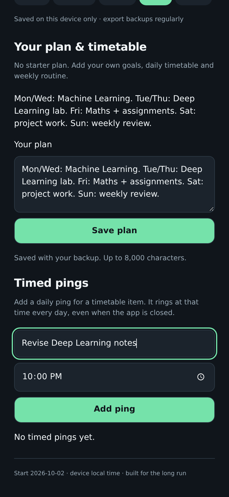

**9. The ping is listed and repeats daily, even when the app is closed. Example: Revise Deep Learning notes at 22:00.**

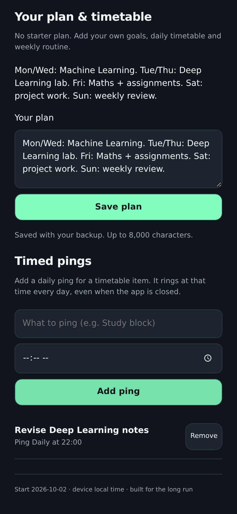

**10. Back on Today, the checklist shows each habit with its ping time and streak.**

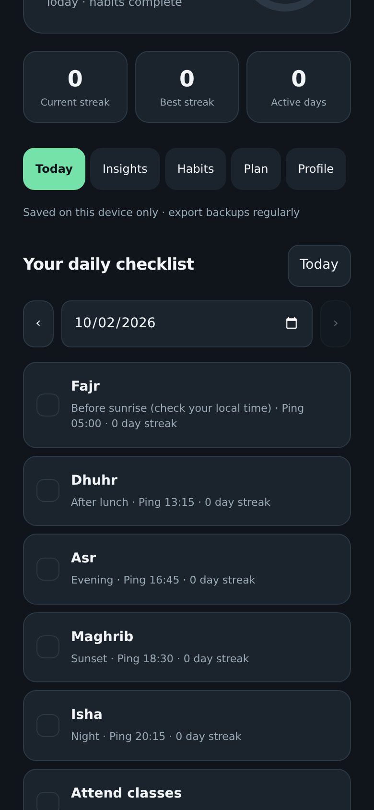

**11. Tick a habit when done. The time you ticked it is saved and shown, for example Ticked 3:38 PM.**

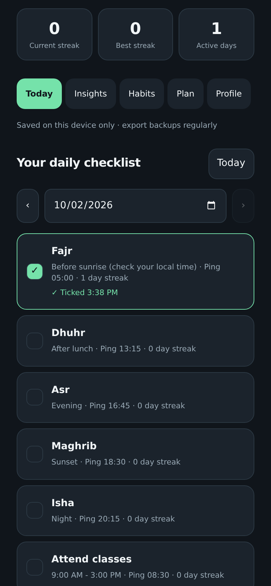

**12. Insights: a yearly heatmap, check-in totals, 30-day rate and per-habit streaks.**

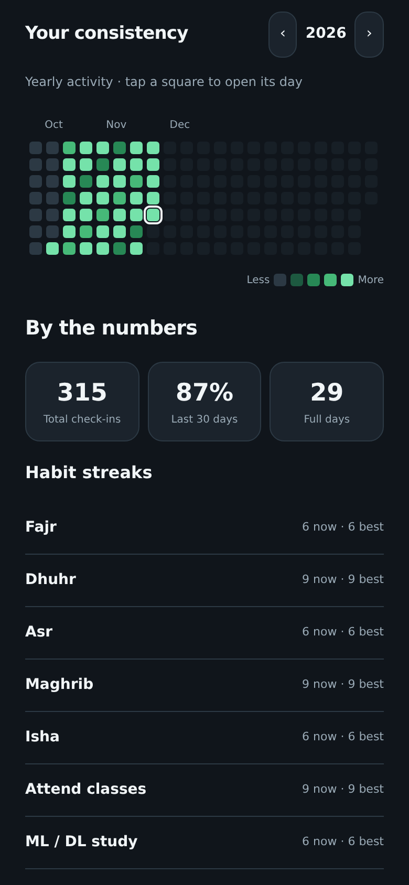

**13. Profile: export a backup file regularly, and restore it on a new phone or after reinstalling.**

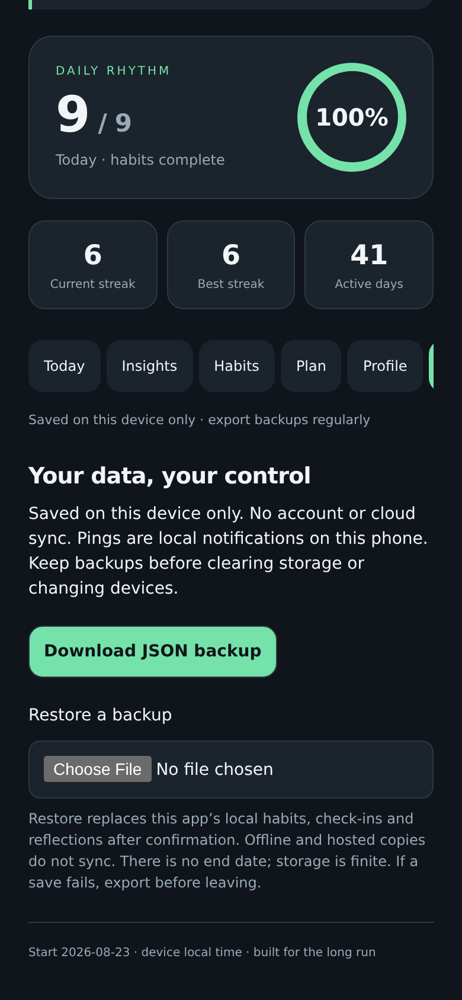

**14. If notifications are off, a banner appears with a Turn on button. Pings cannot show until you allow them.**

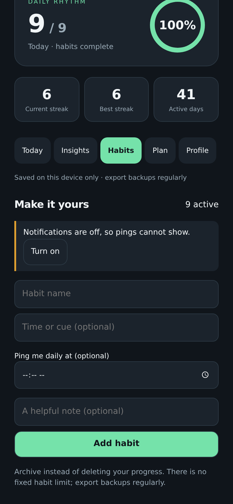

Notes: pings need notification permission, and on some phones exact alarms or battery settings. Entries ticked before version 1.2 show "Tick time not recorded".

## Privacy
Data lives in the app's local storage on your phone. Backups are files you choose where to save. Nothing is uploaded. Keep backups private: they contain your habits, notes and tick times.

## Status
Built and checked in a desktop browser harness and by static APK checks. Real-phone behaviour of notifications, permissions and reboot rescheduling is new in 1.2.0, so please report problems in Issues, with your phone model and Android version.
